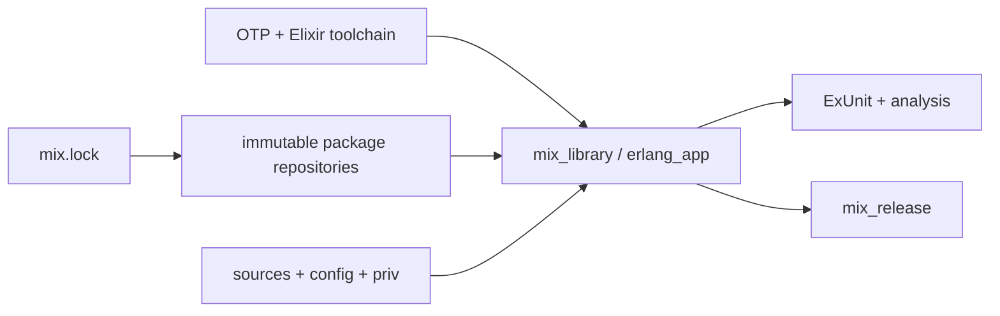

<!--
SPDX-FileCopyrightText: 2026 AbiliSoft
SPDX-License-Identifier: Apache-2.0
-->

# rules_elixir_mix

[](https://github.com/abilisoft/rules_elixir_mix/actions/workflows/test.yaml)
[](https://github.com/abilisoft/rules_elixir_mix/actions/workflows/codeql.yml)
[](https://securityscorecards.dev/viewer/?uri=github.com/abilisoft/rules_elixir_mix)
[](LICENSE)

Hermetic, Mix-first Bazel rules for Elixir and Erlang/OTP applications,
including Phoenix, LiveView, ExUnit, analysis, and releases.

> [!IMPORTANT]
> [`v0.3.2`](https://github.com/abilisoft/rules_elixir_mix/releases/tag/v0.3.2)
> is available as a signed GitHub release but is intentionally not published to
> the Bazel Central Registry yet. Pin its verified commit directly as shown in
> [Getting started](docs/getting_started.md#1-pin-the-ruleset). Source builds
> can use the immutable, latest-tested source catalog shipped with that commit;
> prebuilt runtimes must still come from checksum-pinned producer archives. CI
> proves Bazel 9.2.0 and the
> [catalog-default source tuple](bzlmod/versions.bzl) on Linux x86-64 and Linux
> ARM64; it does not imply support for an untested platform or runtime ABI.

[Get started](docs/getting_started.md) ·
[Browse the docs](docs/README.md) ·
[Choose a rule](docs/rules.md) ·
[Publish](docs/publishing.md) ·
[AI agent playbook](docs/agents/README.md)

## Why this exists

Running an entire Mix project in one giant Bazel action produces one giant
cache entry and hides the real build graph. `rules_elixir_mix` models one OTP
application at a time, resolves OTP and Elixir through Bazel toolchains, and
turns locked packages, tools, generated sources, `priv`, tests, and releases
into declared inputs and outputs.



Bazel owns downloads, checksums, tools, platforms, isolation, and cache keys.
Mix owns Elixir compilation semantics, compiler plugins, ExUnit, and release
assembly. Phoenix and LiveView remain ordinary locked Mix dependencies—not
toolchains.

## What you can model

| Area | Public surfaces |
| --- | --- |
| Elixir and Erlang applications | `mix_library`, `erlang_app`, `rebar_library` |
| Locked dependencies | Bzlmod import from `mix.lock`, including Mix and Rebar packages |
| Locked package interoperability | Public package-relative asset projections and executable Mix escripts |
| Dependency semantics | Separate compile, type, and runtime edges |
| Generated/runtime content | Generated source mappings, `priv`, NIFs, protocol consolidation |
| Tests | ExUnit sharding, EUnit, Common Test, Ecto/Postgres, Wallaby |
| Analysis | format, Elixir 1.20+ type analysis, Dialyzer PLTs, Credo, Sobelow, Xref, coverage |
| Phoenix | digestible assets, releases, local server/code-reload workflows |
| Developer workflows | IEx, generators, Phoenix server, and ElixirLS over the same graph |
| OTP and Elixir | Checksum-pinned prebuilt archives or pristine source builds |
| Crypto/FIPS | Backend-neutral consumption of a producer-owned crypto SDK |

The [rule catalog](docs/rules.md) distinguishes implemented APIs from producer
or platform responsibilities.

## A minimal application

After registering a toolchain and importing `mix.lock`, one production target
and one test target look like this:

```starlark
load(
    "@rules_elixir_mix//:defs.bzl",
    "mix_library",
    "mix_test",
)

mix_library(
    name = "app",
    app_name = "my_app",
    mix_config = "mix.exs",
    srcs = glob(["lib/**/*.ex"]),
    config = glob(["config/**/*.exs"]),
    data = glob(["lib/**/*.eex", "lib/**/*.heex"]),
    priv = glob(["priv/**/*"]),
    runtime_deps = ["@mix_deps//:jason"],
)

mix_library(
    name = "app_test",
    app_name = "my_app",
    mix_config = "mix.exs",
    mix_env = "test",
    srcs = glob(["lib/**/*.ex", "test/support/**/*.ex"]),
    config = glob(["config/**/*.exs"]),
    runtime_deps = ["@mix_deps//:jason"],
)

mix_test(
    name = "test",
    lib = ":app_test",
    srcs = glob(["test/**/*.exs"]),
)
```

The complete quickstart covers the module pin, runtime ABI constraint,
execution platform, prebuilt toolchain, lock import, and verification:
[Getting started](docs/getting_started.md).

## Choose a runtime path

| Choose | When |
| --- | --- |
| [Prebuilt toolchain](docs/prebuilt_toolchains.md) | Fast CI and remote execution with verified, relocatable OTP/Elixir archives |
| [Source toolchain](docs/source_toolchains.md) | OTP configuration, C/C++ toolchain, or crypto SDK must define the runtime artifact |

Both paths are checksum-pinned, platform-constrained, and have no host-runtime
fallback. The runtime ABI constraint must describe the real libc, loader, NIF,
and native-library closure of the execution environment.

For source builds, omitting `otp_version` and `elixir_version` selects the
fixed latest-tested tuple embedded in the pinned `rules_elixir_mix` revision.
It never queries a moving `latest` endpoint. Custom or not-yet-cataloged source
versions require an explicit URL and SHA-256.

A scheduled maintenance workflow checks official stable releases every six
hours and proposes checksum-pinned catalog updates as GitHub-verified commits.
The proposed default tuple must pass the full source-build matrix before merge.

## Hermetic by contract

Ordinary build and test actions:

- invoke declared Elixir/Erlang executables directly;
- run Hex offline and block network access;
- do not run `mix deps.get`;
- do not search the host `PATH` for a BEAM runtime or system OpenSSL;
- avoid generated shell launchers and `run_shell`;
- carry tools, runfiles, and transitive application data through providers.

OTP's upstream source build still requires declared Bash, Make, Perl, POSIX,
and C/C++ tools. An Erlang action driver invokes those tools directly; the
ruleset does not maintain a shell build wrapper.

The repository configuration denies network access by default for local
sandboxed actions, and rules add Bazel's `block-network` execution requirement.
A remote executor must enforce that requirement; Bazel cannot impose a network
namespace on an executor that ignores it.

Writable workflows—generators, code reload, IEx, `phx.server`, and ElixirLS—are
explicit local `bazel run` paths over the real checkout. They are not presented
as cacheable hermetic actions.

## Phoenix, native code, and FIPS

Phoenix and LiveView compile through the normal application graph. JavaScript
and CSS compilation belongs to the corresponding Bazel ecosystem rules;
`mix_phx_assets` handles cacheable `phx.digest` output.

Native and crypto artifacts come from declared producers. This repository can
consume a normalized crypto SDK while building pristine OTP, propagate
FIPS-required runtime activation, and test the shared OTP behavior. It does not
fetch, patch, certify, or silently choose a crypto backend. See the
[backend-neutral crypto SDK contract](docs/source_toolchains.md#backend-neutral-crypto-sdk).

## Documentation

| Guide | Use it for |
| --- | --- |
| [Documentation map](docs/README.md) | Find the shortest path for a task |
| [Core concepts](docs/concepts.md) | Understand application granularity, dependencies, toolchains, and hermeticity |
| [Mix and dependencies](docs/mix.md) | Model Hex/Rebar packages, tests, analysis, Phoenix, NIFs, and local workflows |
| [Releases](docs/releases.md) | Assemble and boot-test immutable releases |
| [AI agent playbook](docs/agents/README.md) | Give a coding agent a non-guessing integration procedure |

## Project

- [Contributing](CONTRIBUTING.md)
- [Support](SUPPORT.md)
- [Security](SECURITY.md)
- [Code of conduct](CODE_OF_CONDUCT.md)
- [Attribution](docs/attribution.md)

The project is licensed under [Apache License 2.0](LICENSE). `NOTICE` and the
attribution guide identify source inherited from earlier rulesets where
applicable.
