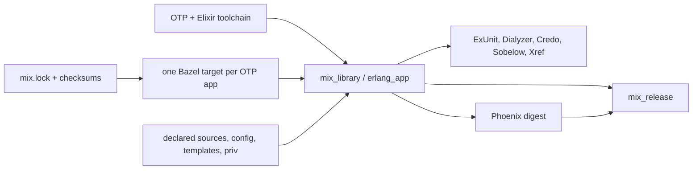

<!--
SPDX-FileCopyrightText: 2026 AbiliSoft
SPDX-License-Identifier: Apache-2.0
-->

# rules_elixir_mix documentation

Build Elixir the way Bazel wants to see it: explicit OTP applications,
checksum-pinned inputs, resolved toolchains, deterministic outputs, and small
cacheable actions—while Mix remains responsible for Elixir semantics.

> [!IMPORTANT]
> This project has not published its first stable release or official runtime
> archive set. Pin a GitHub-verified commit and bring checksum-pinned OTP and
> Elixir archives. The CI-proven reference combination is Bazel 9.2.0, OTP
> 29.0.3, and Elixir 1.20.2 on Linux x86-64.

## Choose your path

| Goal | Start here |
| --- | --- |
| Build a first Mix application | [Getting started](getting_started.md) |
| Understand why the graph is shaped this way | [Core concepts](concepts.md) |
| Find the right public rule | [Rule catalog](rules.md) |
| Import Hex/Rebar dependencies and native packages | [Mix and dependencies](mix.md) |
| Use published OTP and Elixir archives | [Prebuilt toolchains](prebuilt_toolchains.md) |
| Build pristine OTP and Elixir sources | [Source toolchains](source_toolchains.md) |
| Assemble and test an OTP release | [Releases](releases.md) |
| Integrate a generic FIPS crypto SDK | [FIPS ownership](source_toolchains.md#backend-neutral-crypto-sdk) |
| Guide an AI coding agent | [Agent playbook](agents/README.md) |
| Understand inherited source/licensing context | [Attribution](attribution.md) |

## The 30-second model

Bazel owns identity and execution: downloads, checksums, platforms, tools,
inputs, runfiles, isolation, and caches. Mix owns project semantics:
compilation, protocols, tasks, ExUnit, and releases. Neither side impersonates
the other.

## What is proven today

| Capability | Status |
| --- | --- |
| Bzlmod, Bazel 9.2+, Linux execution | CI required |
| OTP 29.0.3 + Elixir 1.20.2 source build | CI required |
| Checksum-pinned prebuilt OTP/Elixir consumption | Implemented and analyzed |
| Mix and Rebar dependency import from `mix.lock` | Integration tested |
| Compile/type/runtime dependency separation | Analysis and Dialyzer tested |
| ExUnit sharding, EUnit, Common Test | Integration tested |
| Phoenix, LiveView, assets, releases | Integration tested |
| Format, Credo, Dialyzer, Sobelow, Xref, type analysis | Integration tested |
| Ecto/Postgres and Wallaby declared runtimes | Analysis tested; real service/browser matrix not yet in CI |
| Rustler/NIF artifact mapping | Analysis tested |
| `mix_local` warm-cache workflow | Integration tested |
| Phoenix server and ElixirLS local entry points | Analysis tested |
| Static and provider-backed generic FIPS contracts | Analysis tested; requires producer-backed runtime proof |
| macOS, Windows, cross-built ERTS/NIFs | Not claimed |
| Official downloadable runtime matrix | Not published yet |

“Implemented” does not mean every producer combination is certified. A crypto
SDK producer owns backend validation and provenance; a runtime archive producer
owns its platform matrix. This repository proves only its consumer contract.

## Concepts you should know

- An **OTP application** is the cache and dependency unit. A whole umbrella is
  not one compilation action.
- A **toolchain** selects executable OTP and Elixir plus their runtime closure.
  Phoenix and LiveView are packages, not toolchains.
- A **runtime ABI constraint** represents libc, loader, NIF ABI, native system
  closure, and immutable worker image—not only OS and CPU.
- **Hermetic actions** never call `mix deps.get`, search the host `PATH`, use a
  host BEAM, or discover system OpenSSL.
- **Local workflows** such as `phx.server`, IEx, code reload, generators, and
  ElixirLS are intentionally writable `bazel run` paths over the real workspace.

Read [Core concepts](concepts.md) before designing a new rule or integrating a
native dependency.

## Getting help or contributing

- [Support policy](../SUPPORT.md)
- [Contributing guide](../CONTRIBUTING.md)
- [Security policy](../SECURITY.md)
- [Code of conduct](../CODE_OF_CONDUCT.md)

Bug reports are most useful when they include a minimal public target, exact
versions and platform constraints, the full Bazel command, and whether an
identical second invocation reused the cache.
