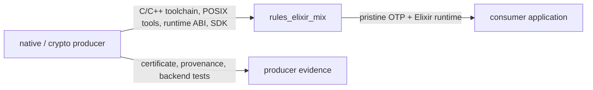

<!--
SPDX-FileCopyrightText: 2026 AbiliSoft
SPDX-License-Identifier: Apache-2.0
-->

# Core concepts

[Documentation home](README.md) · [Getting started](getting_started.md) ·
[Rule catalog](rules.md)

rules_elixir_mix is not a wrapper around `mix compile`. It is a Bazel model of
the parts Mix needs to see.

## Two owners, one build

| Bazel owns | Mix owns |
| --- | --- |
| Repository downloads and integrity | Elixir compiler semantics |
| OTP/Elixir toolchain selection | Mix project evaluation |
| Execution and target platforms | Compiler plugins and protocols |
| Declared tools, inputs, outputs, and runfiles | ExUnit and Mix tasks |
| Network isolation and writable action state | OTP release assembly |
| Incremental and remote cache identity | Framework conventions |

The boundary prevents both common failures: a giant opaque Mix action with
hidden dependencies, and a fake Starlark reimplementation of Mix semantics.

## OTP applications are the graph nodes

Each `mix_library`, `erlang_app`, imported Hex package, or imported Rebar
package produces one OTP-application-shaped Bazel target. Downstream actions see
only their declared application closure through stable providers and `ERL_LIBS`.

That granularity gives Bazel useful work to cache:

```text
jason ───────────────┐
phoenix ───────┐     │
phoenix_html ──┼──> web_app ──> ExUnit
live_view ─────┘        │       Credo
domain_app ─────────────┘       Dialyzer
                         └────> release
```

Changing `domain_app` does not recompile every unrelated Hex package. Changing
one locked package invalidates that package and its consumers, not an entire
staged workspace.

## Three dependency edges

| Edge | Visible while compiling? | Propagated at runtime? | Typical use |
| --- | --- | --- | --- |
| `compile_deps` | Yes | No | Macros, parse transforms, build-time helpers |
| `type_deps` | For type analysis | No | Remote types included in a Dialyzer PLT |
| `runtime_deps` | Yes | Yes | Applications started or called at runtime |

`deps` remains a compatibility spelling appended to `runtime_deps`. Prefer the
explicit edge in new targets.

This distinction matters for releases and PLTs. A compiler plugin should not
appear in a production release, and a remote type dependency should not drag an
unrelated build tool into Dialyzer.

## Toolchains are runtimes, not frameworks

OTP and Elixir are executable toolchains. Their identity includes:

- exact versions and archive contents;
- `erlexec` and the Elixir BEAM library root;
- execution OS and CPU;
- libc, loader, NIF ABI, and native runtime closure;
- source-build C/C++ and POSIX tools when applicable;
- configure/link options and crypto SDK when applicable.

Phoenix, LiveView, Plug, Ecto, Wallaby, Credo, Sobelow, and Dialyxir are normal
locked application dependencies. Making them toolchains would hide ordinary
dependency edges and multiply platform variants without benefit.

## Source versus prebuilt

| Choose | When | Cost profile |
| --- | --- | --- |
| `prebuilt_toolchain` | Normal CI and development; runtime already verified | Fast repository fetch and extraction |
| `source_toolchain` | OTP native configuration is part of the required artifact | One large deterministic build action |

The source action is intentionally coarse because OTP's upstream build is a
single configure/Make system. It is still hermetic and remotely cacheable.
Publish each verified `{OTP, platform, toolchain, flags, crypto SDK}` result and
reuse it as a prebuilt archive across the fleet.

## Hermetic versus local workflows

Builds, tests, analysis, asset digesting, and releases run in isolated actions.
They do not write the source checkout.

Some developer experiences fundamentally require a writable workspace:

- `phx.server` and code reload;
- IEx;
- generators;
- ElixirLS;
- iterative local Mix tasks.

`mix_local`, `mix_phx_server`, `mix_iex`, and `elixir_ls` make that exception
explicit as `bazel run` targets. They use the selected hermetic runtime and
fingerprinted dependency graph but maintain mutable state below
`.bazel/elixir_mix`. They are not build inputs and are not remote actions.

## Native code and FIPS ownership



rules_elixir_mix stays backend-neutral. It consumes a normalized SDK, builds or
verifies OTP, propagates early FIPS activation, packages declared runtime state,
and tests shared behavior. It does not fetch crypto implementations, claim a
certificate, interpret backend metadata, or silently substitute a provider.

The same boundary applies to Rustler and other NIFs: the appropriate Bazel
language rules build the shared library; `elixir_nif` maps that declared output
into `priv/native`.

## What “hermetic” means here

An ordinary action is acceptable only when:

- every file and executable it reads is a Bazel input or toolchain artifact;
- its meaningful environment is explicit and stable;
- writable state is action-local;
- its output does not embed unstable source/cache paths;
- networking is blocked;
- it cannot discover a host BEAM, compiler, OpenSSL, browser, or database;
- a second identical invocation can safely reuse the result on another worker.

Hermetic does not mean “runs in a container.” The platform image is one declared
part of the execution contract; it does not excuse undeclared files inside the
image.

The workspace disables sandbox networking by default and ordinary actions also
request Bazel's `block-network` execution requirement. That request is only as
strong as the selected sandbox or remote executor. A consumer must use an
executor that enforces it; the ruleset cannot retrofit isolation into an
executor that deliberately ignores execution requirements.
